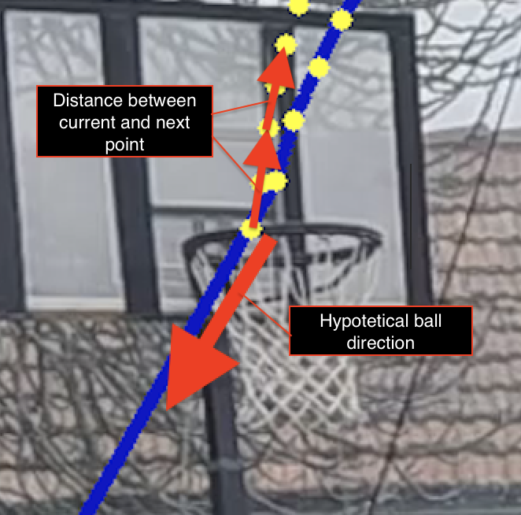

# ProgettoSIV

### Basketball tracking
The project consists in finding and tracing the position of a basketball shot from the free throw line.

We chose some video of people shooting a basketball, trying to select ones with an unmoving camera and a clean background. As it turns out, not many videos online have these properties.
It is possible to change the video analyzed with the parameter *video_number* of the function *execute()*.

Our first idea was to use a **Yolo classifier** to identify the position of the ball and track it accurately however, we soon realized we could get away with a much simpler **Blob Detector**, which selects groups of pixels with similar properties.
Experimenting with the parameters, we were mostly succesful in identifying the basketball. 

In the instances where the Simple Blob Detector fails, we still made possible the selection of the ball, toggling the property *select_area* of the function *execute()*.

Once the first instance of the basketball is found, we made use of a **Motion Tracker** to trace the object frame by frame.
Since many different object tracker were available, we allowed switching between them using the parameter *tracker_type* of the function *execute()*.

All the points found during the shot are used to calculate the trajectory of the ball, using **linear interpolation**. 
Since the ball most of the times hits the rim, it's trajectory will change. To prevent excessive swings in the calculated preview, we removed all the points where the x axis value isn't monotonic.
For example, if at time *t*, the ball has x value *100* and is going towards the right, we remove  any points at time later than *t* that have value smaller than *100*.
This adjustment is only necessary during the estimation of the trajectory. 

To determine whether the shot ended in a score or a miss, we were planning to find the basket position. However, we found extremely difficult pin-pointing this object, as in all videos is always still, and the colorful environment made it tough to use color recognition.

To still be able to give an approximation of the probability of success, without resorting to a machine learning approach, we calculated the **variance** between the points from the ideal trajectory (the one we estimated) and the points from the actual movement of the ball. 

First of all, we calculated the estimated ball direction as a vector, by subtracting the last point (extrapolated maximum) by the last position tracked.
This vector also needs to be normalized, by doing this, we are able to multiply any distance by this direction vector, and obtain the new estimated ball position.

Then, for all the points tracked after the ball hit the rim, we calculated the distance between the position given by the tracker, and the one estimated using the previously calculated direction.
A missed shot will have a larger variance between tracked and estimated position, while an airball will have no difference, as the ball never leaves the trajectory. 
This way we can differenciate, using two threshold, the outcome of the shot, without having to resort to machine learning, or having to identify the basket.

### Video List

- 1: Ball tracked, outcome classified correctly
- 2: Ball is not found right away, the blob detector has problems identifying the ball, once it finds it, the motion tracker has problems maintaining sight, probably becouse of the bottom view of the rim.
- 3: Ball tracked, outcome classified incorrectly -> look into variance (maybe video too long?)
- 4: Ball tracked, outcome classified correctly
- 5: Ball not tracked right away, the blob detector seems to have problems, probably becouse of the different coloring of the ball passing across a background full of objects. As soon as the ball goes on top the white roof section, the blob detector is able to identify it.
- 6 Ball tracked, outcome classified incorrectly (video is too short)
- 7 Ball tracked, outcome classified correctly
- 8 Ball is tracked as soon as it passes on top of the white background. The blob detector is probably not able to find it in front of the tree.
- 9 Ball tracked, outcome classified incorrectly

#### TODO
 - [x] Custom parameters for each video (file parameter_utils.py)
 - [x] calculate_curve() in motion_tracking.py sometimes catches wrong y position  
    (es. video 1)
 - [x] Try to make work evaluate_shot() work with temporal variance
 - [ ] Check for typo and bad english in explanation above